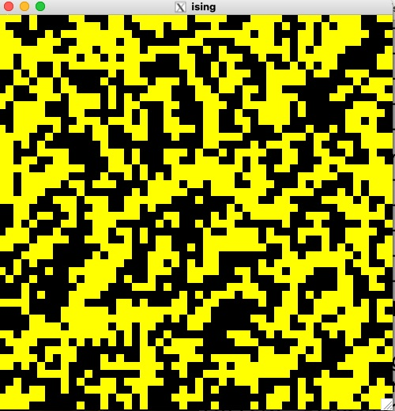

# Ising

This program calculates the 2D Ising model using the Mersenne Twister in [GSL](https://www.gnu.org/software/gsl/) for random number generation and [EGGX](https://www.ir.isas.jaxa.jp/~cyamauch/eggx_procall/index.html) for graphics. Compile the code with the following command.

```
egg ising.c -lgsl -lgslcblas
```

